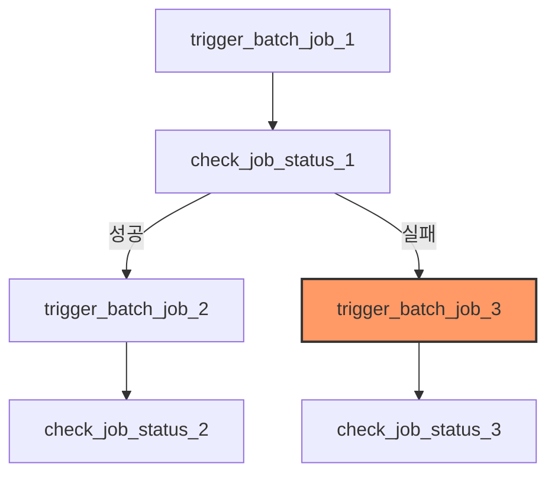

# Spring Batch Airflow DAG 가이드

이 문서는 Airflow를 사용하여 Spring Batch Job을 오케스트레이션하는 `spring_batch_sample_job` DAG의 구조와 설정 방법을 설명합니다.

## 1. 개요
이 DAG는 외부 Spring Batch 애플리케이션의 API 엔드포인트를 호출하여 배치 작업을 실행하고, 그 상태를 확인하는 워크플로우를 관리합니다.

- **DAG ID**: `spring_batch_sample_job`
- **주요 기능**: 
    - Spring Batch Job 트리거 (POST 요청)
    - 실행된 Job의 상태 모니터링 (GET 요청)
    - Job 실패 시 대체 작업 실행 (Trigger Rule 활용)

## 2. 워크플로우 구조

- **표준 흐름**: Job 1 성공 시 Job 2를 연속해서 실행합니다.
- **예외 흐름**: Job 1 실패 시 `trigger_rule="all_failed"`에 의해 Job 3(복구 또는 대체 작업)가 실행됩니다.

## 3. 스케줄링 설정 (`schedule`)

Airflow DAG의 실행 주기는 `schedule` 파라미터를 통해 유연하게 설정할 수 있습니다.

### A. `timedelta` 활용 (일정 간격 실행)
실행 완료 시점과 상관없이 정해진 시간 간격마다 실행하고자 할 때 사용합니다.
- `timedelta(minutes=5)`: 5분마다 실행
- `timedelta(hours=1)`: 1시간마다 실행
- `timedelta(days=1)`: 매일 24시간 간격으로 실행

### B. Cron 표현식 활용 (특정 시점 실행)
특정 시각, 특정 요일에 실행해야 할 때 유용합니다.
- `"0 0 * * *"`: 매일 자정(00:00)에 실행
- `"0 9 * * 1"`: 매주 월요일 오전 9시에 실행
- `"0 0 1 * *"`: 매월 1일 자정에 실행

### C. Airflow Presets
- `"@hourly"`: 매시간 정각 실행
- `"@daily"`: 매일 자정 실행
- `"@weekly"`: 매주 일요일 자정 실행

## 4. 구성 요소 설명

### 유틸리티 함수 (`utils/spring_batch.py`)
- **`trigger_spring_batch_job`**: Spring Batch 서버에 POST 요청을 보냅니다. 호출 결과로 받은 `jobExecutionId`를 Airflow XCom에 저장합니다.
- **`check_batch_job_status`**: XCom에서 ID를 읽어와 해당 Job의 최종 상태(`COMPLETED`, `FAILED` 등)를 확인합니다. `FAILED`나 `STOPPED` 상태일 경우 Airflow Task를 실패 처리합니다.

### 주요 태스크
- **`trigger_batch_job_*`**: 특정 엔드포인트(예: `/sample`, `/sample2`)로 작업을 요청합니다.
- **`check_job_status_*`**: 이전 트리거 태스크의 상태를 비동기적으로 체크합니다.

## 5. 변경 이력 및 유지보수
- **로그 보관**: 현재 시스템 로그는 7일간 보관하도록 권장됩니다. (Crontab 또는 Cleanup DAG 활용)
- **Timezone**: 모든 스케줄링 기준 시간은 Airflow 설정에 따른 UTC 또는 로컬 시간을 따릅니다.
